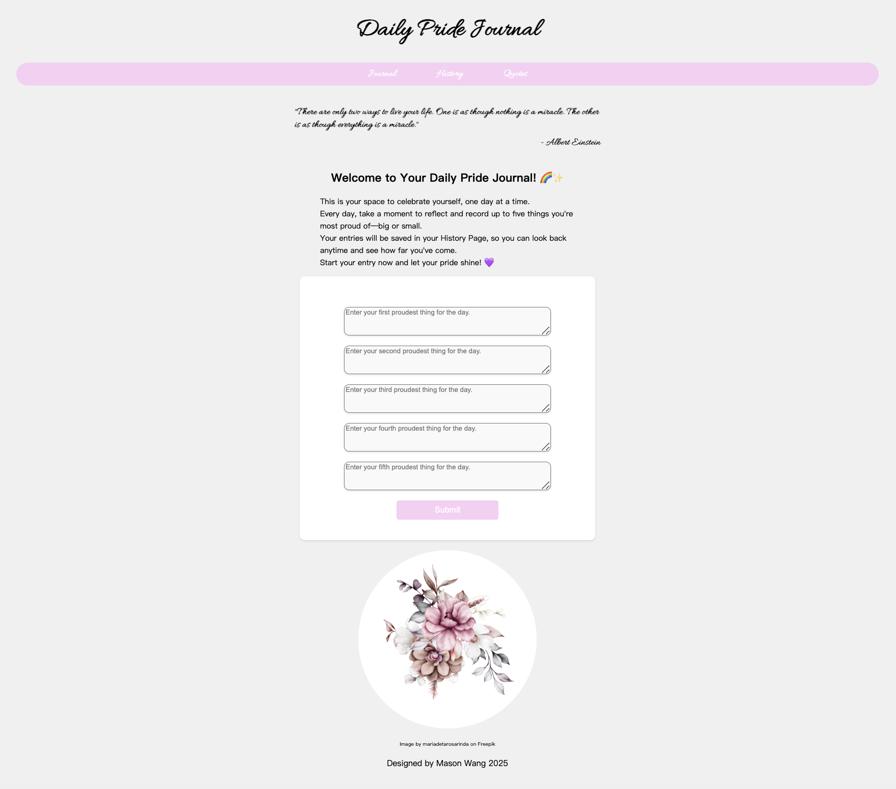
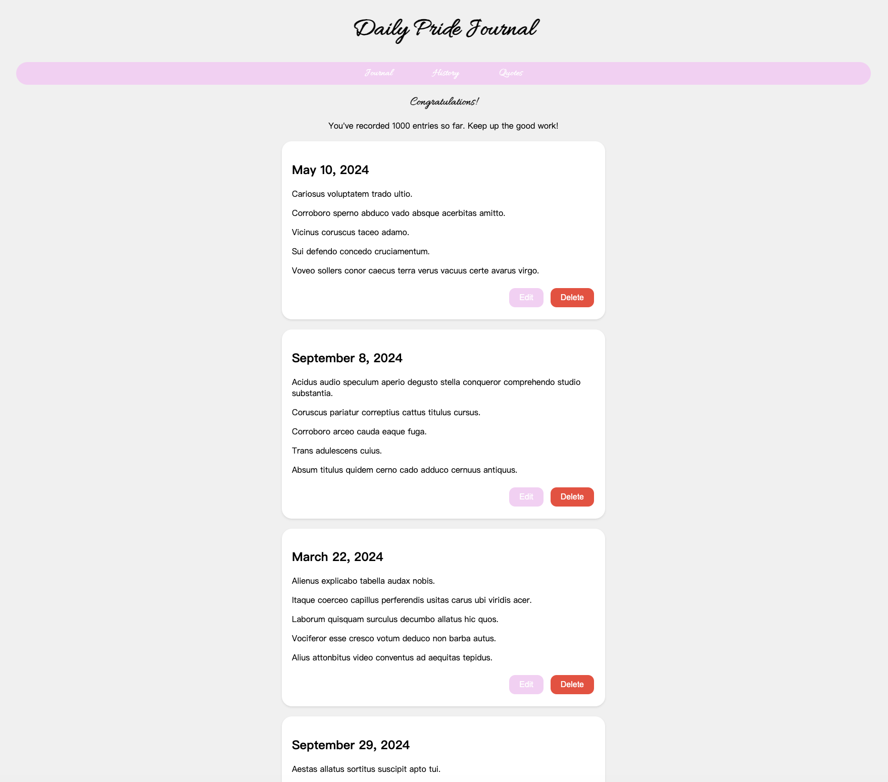
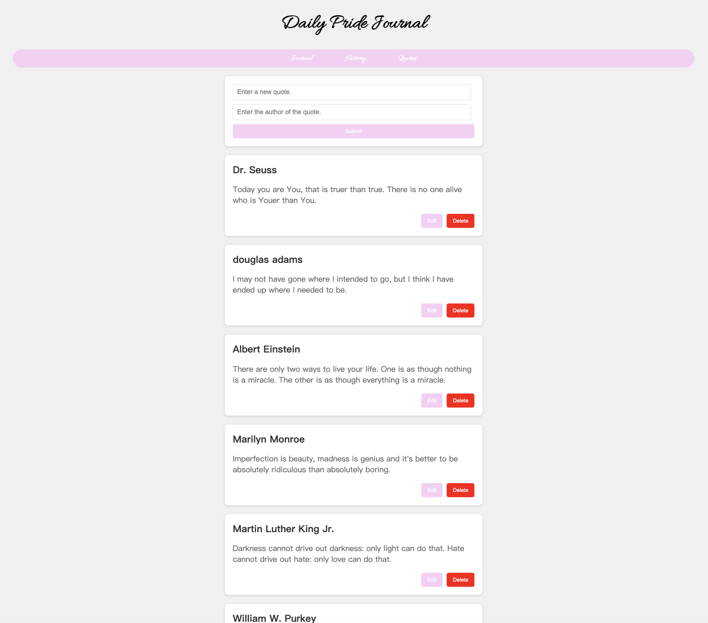

# Daily Pride Journal

## Author
**Name**: Yachen Wang (Mason)  
**Class**: CS5610 - Web Development   

**Class Link**: https://johnguerra.co/classes/webDevelopment_spring_2025/  
**Design Doc**: https://docs.google.com/document/d/1EO92k3asR6pwD6PMdJCZ0HBWyti_d1t3dFtmEtAAr80/edit?usp=sharing   
**Slides**: https://docs.google.com/presentation/d/1hQVvfzQ_0DJ0mP3lJyMOtLlPOERtxukz_8_sRUmA1Ps/edit?usp=sharing  
**Demo**: https://daily-pride-journal.vercel.app/  
**Video**: https://youtu.be/EA-7ZLA1LIM    
**Wireframe**: https://www.figma.com/design/jOlurv2gUqCZRYERU6Orv0/WebDev-Project-2-Mockup?t=LougloaexkRifHL9-1  

## Project Overview
**Daily Pride Journal** is a lightweight web application designed to **help users cultivate self-reflection and gratitude by recording their five proudest moments each day**. Built with **Node.js**, **Express.js**, **MongoDB**, and **Vanilla JavaScript**, the app provides a simple yet effective way to track personal growth over time. By fostering a habit of positive self-affirmation, Daily Pride Journal empowers users to recognize their achievements, big or small, and develop a more appreciative mindset.

**Frontend Development**: HTML, CSS, JavaScript  
**Backend Development**: Node.js, Express  
**Database**: MongoDB  
**Development Tools**: VS Code (with ESLint & Prettier)  
**Deployment**: Vercel  

## Screenshots
### Journal Page  
  

### History Page  
  

### Quotes Page  
  

## Instructions to Build

***Option 1: Live Demo***  

https://daily-pride-journal.vercel.app/  
Backend deployed with Vercel. Database deployed with MongoDB Atlas.

***Option 2: Run Locally***  

**Step 1: Git clone this repository**  
git clone https://github.com/masonwangmason/Daily-Pride-Journal.git

**Step 2: Navigate to the project directory**  
cd Daily-Pride-Journal

**Step 3: Install dependencies**  
npm install

**Step 4: Create your .env file**  
Create a **.env** file in the root directory and add the following content:  

**PORT=3000**  
**MONGODB_URI=your_mongodb_connection_string**  

Replace **your_mongodb_connection_string** with your actual MongoDB connection string.

**Step 5: Run the server**  
npm start

**Step 6: Visit the following URL in your desired browser**  
http://localhost:3000

## License
This project is licensed under the MIT License. See the LICENSE file for details. 

## Credits
Image by **mariadetarosarinda** on Freepik: https://www.freepik.com/author/mariadetarosarinda  
Font by **Allura** on Google Fonts: https://fonts.google.com/specimen/Allura  

## LLM Citation
"Is there a way i can automatically set the newDate to the current date?"

"Why is the node module file still exist in my github after i push, even though I've added the .gitignore file?"

"How can I change the layout of history cards so when an user clicks edit, it will enable them to edit the entries?" 

"is there a way you can help me write 1000+ entries for my database and put them on mongo?"  
